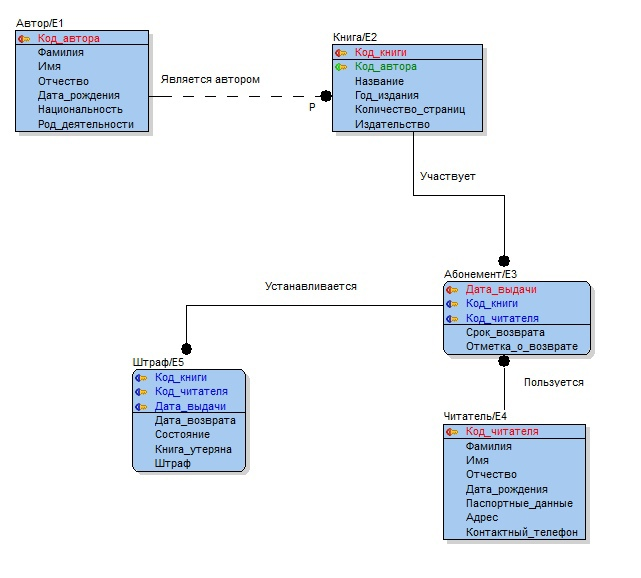

# Библиотека - пример работы с EF
## Создание БД и импорт данных
Для приложения используется **MSSQL Server**
* Название БД - library
* Create_tables.sql - скрипт для создания таблиц
* data.xlsx - тестовые данные

